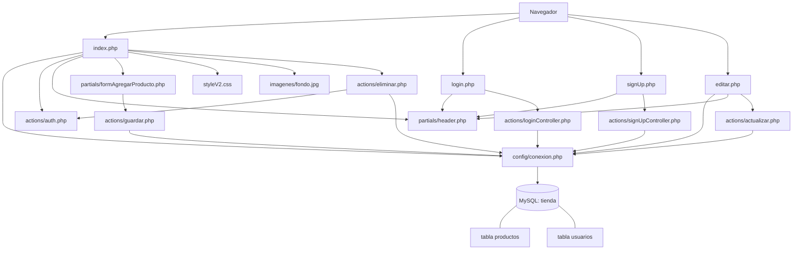

# Tienda — CRUD con PHP y MySQL

Aplicación web didáctica desarrollada con **PHP**, **MySQL (PDO)**, HTML, CSS y JavaScript. Permite administrar un catálogo de productos y manejar usuarios con autenticación por sesión y roles.

> Proyecto pensado para ejecutarse localmente con XAMPP.

## Funcionalidades

- Ver el listado de productos.
- Crear productos desde una ventana modal.
- Editar nombre, stock y precio de cada producto.
- Eliminar productos (solo si el usuario logueado tiene rol `admin`).
- Registrar usuarios con contraseña cifrada mediante `password_hash`.
- Iniciar sesión con `password_verify`.
- Mantener la sesión del usuario y mostrar si es administrador o usuario normal.
- Mostrar mensajes de error de autorización en la pantalla principal.

## Tecnologías y requisitos

| Componente | Uso en el proyecto |
| --- | --- |
| Apache + PHP | Servidor y procesamiento de las páginas PHP. |
| MySQL / MariaDB | Base de datos `tienda`. |
| PDO MySQL | Conexión y consultas preparadas a la base de datos. |
| HTML, CSS, JavaScript | Interfaz, estilos y apertura/cierre del formulario modal. |
| XAMPP | Entorno local recomendado. |

Requisitos mínimos:

- XAMPP con los módulos **Apache** y **MySQL** disponibles.
- PHP con la extensión `pdo_mysql` habilitada (viene normalmente incluida en XAMPP).
- Un navegador web moderno.

## Estructura del proyecto

```text
php-6to-3-9/
├── index.php                         # Pantalla principal y listado de productos
├── editar.php                        # Formulario para modificar un producto
├── login.php                         # Formulario de inicio de sesión
├── signUp.php                        # Formulario de registro
├── styleV2.css                       # Estilos globales de la interfaz
├── config/
│   └── conexion.php                  # Conexión PDO a MySQL
├── actions/
│   ├── auth.php                      # Sesión y funciones de autorización
│   ├── guardar.php                   # Inserta productos
│   ├── actualizar.php                # Actualiza productos
│   ├── eliminar.php                  # Elimina productos si el rol es admin
│   ├── loginController.php           # Valida credenciales e inicia sesión
│   └── signUpController.php          # Registra usuarios y cifra la contraseña
├── partials/
│   ├── header.php                    # Cabecera HTML y enlace a la hoja de estilos
│   ├── formAgregarProducto.php       # Formulario reutilizado para crear productos
│   └── userStats.php                 # Navegación auxiliar basada en el rol
└── imagenes/
    └── fondo.jpg                     # Fondo de la interfaz
```

## Diagrama de conexión entre archivos



## Flujo de uso

1. Al entrar en `index.php`, se abre la conexión, se inicia/revisa la sesión y se consultan todos los registros de `productos`.
2. El botón **Agregar producto** muestra el formulario de `partials/formAgregarProducto.php`; este envía un `POST` a `actions/guardar.php`.
3. El enlace **Editar** abre `editar.php?id=...`, que busca el producto y envía los cambios a `actions/actualizar.php`.
4. El enlace **Eliminar** llama a `actions/eliminar.php?id=...`. Ese archivo comprueba `es_admin()` antes de ejecutar el `DELETE`.
5. El registro envía el formulario a `actions/signUpController.php`, que guarda la contraseña con hash.
6. El inicio de sesión consulta al usuario en `actions/loginController.php`; si la contraseña es correcta, guarda `usuario` y `rol` en `$_SESSION`.

## Base de datos

La aplicación espera una base llamada **`tienda`** con dos tablas: **`usuarios`** y **`productos`**.

### Crear la base con phpMyAdmin

1. Abra el panel de XAMPP e inicie **Apache** y **MySQL**.
2. Entre a [http://localhost/phpmyadmin](http://localhost/phpmyadmin).
3. Seleccione la pestaña **SQL**.
4. Pegue y ejecute el siguiente script completo:

```sql
CREATE DATABASE IF NOT EXISTS tienda
  CHARACTER SET utf8mb4
  COLLATE utf8mb4_unicode_ci;

USE tienda;

CREATE TABLE IF NOT EXISTS usuarios (
  id INT UNSIGNED AUTO_INCREMENT PRIMARY KEY,
  usuario VARCHAR(100) NOT NULL UNIQUE,
  contrasena VARCHAR(255) NOT NULL,
  roll VARCHAR(20) NOT NULL DEFAULT 'user'
) ENGINE=InnoDB DEFAULT CHARSET=utf8mb4;

CREATE TABLE IF NOT EXISTS productos (
  id INT UNSIGNED AUTO_INCREMENT PRIMARY KEY,
  nombre VARCHAR(150) NOT NULL,
  stock INT NOT NULL,
  precio DECIMAL(10,2) NOT NULL
) ENGINE=InnoDB DEFAULT CHARSET=utf8mb4;
```

El campo se llama `roll` (con dos letras **l**) porque así está escrito en el código PHP. No lo renombre a `rol` sin modificar también `actions/loginController.php` y `actions/signUpController.php`.

### Datos de prueba opcionales

Puede cargar productos directamente:

```sql
USE tienda;

INSERT INTO productos (nombre, stock, precio) VALUES
  ('Teclado mecánico', 12, 45000.00),
  ('Mouse inalámbrico', 25, 18500.50),
  ('Monitor 24 pulgadas', 8, 220000.00);
```

Para usuarios, use el formulario `signUp.php`: así la contraseña se almacena correctamente con hash. Para poder eliminar productos, registre un usuario con `admin/user` igual a `admin`; para un usuario estándar, use `user`.

### Relación con el código

| Tabla | Columnas utilizadas | Archivos que la usan |
| --- | --- | --- |
| `productos` | `id`, `nombre`, `stock`, `precio` | `index.php`, `editar.php`, `guardar.php`, `actualizar.php`, `eliminar.php` |
| `usuarios` | `id`, `usuario`, `contrasena`, `roll` | `signUpController.php`, `loginController.php`, `auth.php` |

Actualmente no hay claves foráneas entre ambas tablas: los productos no se asocian a un usuario.

## Instalación y ejecución con XAMPP

1. Instale XAMPP si todavía no lo tiene.
2. Copie o clone esta carpeta dentro del directorio web de XAMPP. La ubicación esperada para este proyecto es:

   ```text
   C:\xampp\htdocs\clase\php-6to-3-9
   ```

3. En el panel de control de XAMPP, inicie los servicios **Apache** y **MySQL**.
4. Cree la base y las tablas siguiendo el script de la sección anterior.
5. Revise [`config/conexion.php`](config/conexion.php). Para la configuración por defecto de XAMPP debe quedar así:

   ```php
   $servidor = "localhost";
   $usuario = "root";
   $clave = "";
   $basedatos = "tienda";
   ```

   Si su MySQL tiene otra contraseña, cambie únicamente `$clave`. Si usa otro usuario o puerto, adapte el DSN de PDO según su instalación.

6. Abra en el navegador:

   ```text
   http://localhost/clase/php-6to-3-9/
   ```

7. Registre un usuario desde **sign up**, inicie sesión y pruebe el CRUD de productos.

## Endpoints y métodos HTTP

| Ruta | Método | Propósito | Parámetros esperados |
| --- | --- | --- | --- |
| `/index.php` | GET | Lista productos y muestra el formulario de alta. | `error` opcional para mensaje. |
| `/editar.php` | GET | Muestra un producto para editar. | `id`. |
| `/actions/guardar.php` | POST | Crea un producto. | `nombre`, `stock`, `precio`. |
| `/actions/actualizar.php` | POST | Actualiza un producto. | `id`, `nombre`, `stock`, `precio`. |
| `/actions/eliminar.php` | GET | Elimina un producto si el rol es `admin`. | `id`. |
| `/login.php` | GET | Muestra el acceso. | — |
| `/actions/loginController.php` | POST | Inicia una sesión. | `username`, `password`. |
| `/signUp.php` | GET | Muestra el registro. | — |
| `/actions/signUpController.php` | POST | Crea un usuario. | `username`, `password`, `rol`. |

## Autenticación y autorización

`actions/auth.php` inicia la sesión e incluye dos funciones:

```php
esta_logeado(); // true si existe $_SESSION['usuario']
es_admin();     // true si $_SESSION['rol'] es exactamente 'admin'
```

Al iniciar sesión correctamente se guardan estos datos:

```php
$_SESSION['usuario'];
$_SESSION['rol'];
```

La acción de eliminar está protegida por `es_admin()`. Tal como está hoy el proyecto, la creación y la edición de productos no comprueban el rol en el servidor. El enlace de “Cerrar Sesión” que aparece en `partials/userStats.php` aún no tiene controlador asociado.

## Consultas principales

- Listado: `SELECT * FROM productos`.
- Búsqueda para edición: `SELECT * FROM productos WHERE id = :id`.
- Alta: `INSERT INTO productos (nombre, stock, precio) ...`.
- Modificación: `UPDATE productos SET ... WHERE id = :id`.
- Baja autorizada: `DELETE FROM productos WHERE id = :id`.
- Registro: `INSERT INTO usuarios (usuario, contrasena, roll) ...`.
- Login: búsqueda del usuario por `usuario` y validación con `password_verify`.

Las escrituras y búsquedas por identificador usan sentencias preparadas con PDO.

## Notas y mejoras recomendadas

Este repositorio tiene carácter educativo. Para llevarlo a producción conviene implementar, como mínimo:

- Validación exhaustiva en servidor para todos los datos de entrada (incluidos valores negativos y formatos).
- Escape de la salida HTML con `htmlspecialchars` para evitar XSS.
- Protección con sesión/rol también en `guardar.php`, `actualizar.php` y `editar.php`.
- Usar `POST` con token CSRF para eliminar, en lugar de un enlace `GET`.
- Comprobar que el usuario exista antes de leer su contraseña en el login.
- No permitir que un visitante elija libremente el rol `admin` en el registro público.
- Implementar cierre de sesión y mensajes de éxito consistentes.
- Mover credenciales a variables de entorno y desactivar la visualización de errores en producción.

## Solución de problemas

| Problema | Posible causa y solución |
| --- | --- |
| `Error de conexión` | Confirme que MySQL esté iniciado, que exista `tienda` y que usuario/contraseña en `config/conexion.php` sean correctos. |
| `Unknown database 'tienda'` | Ejecute el script SQL de creación de base de datos. |
| `Table 'tienda.productos' doesn't exist` | Ejecute la creación de las dos tablas indicada arriba. |
| La página muestra código PHP o no abre | Abra el proyecto desde `http://localhost/...`, no desde el archivo local; compruebe que Apache esté activo. |
| No puedo eliminar | Inicie sesión con un usuario cuyo campo `roll` sea exactamente `admin`. |
| No se ven estilos o fondo | Confirme que la URL tenga la carpeta correcta y que existan `styleV2.css` e `imagenes/fondo.jpg`. |

## Licencia

No se definió una licencia en el repositorio. Agregue una (por ejemplo, MIT) antes de redistribuir el proyecto.
